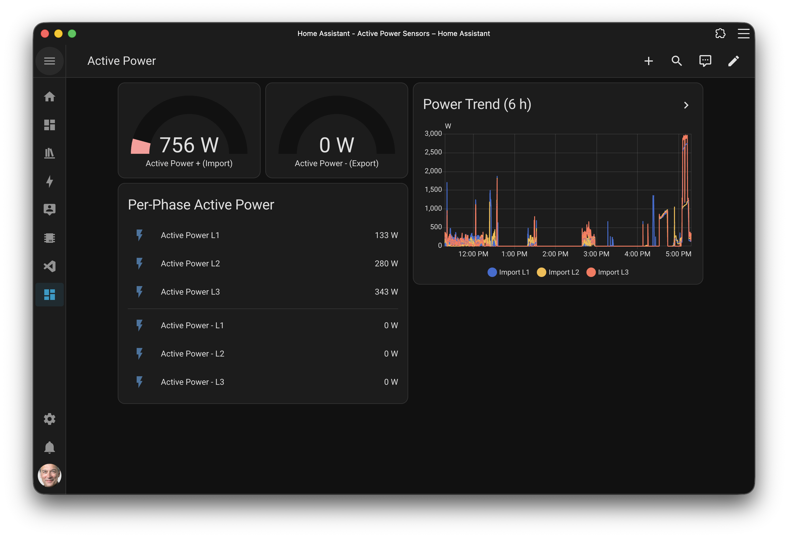

# ESPHome Component for the gPlugK



## Overview

This project connects a Kamstrup Omnipower smart meter to Home Assistant using three main components that work together in a pipeline:

```text
Smart Meter  -->  gPlugK  -->  ESPHome  -->  Home Assistant
  (M-Bus)       (hardware)    (firmware)      (dashboard)
```

### gPlugK -- The Hardware Adapter

The [gPlugK](https://gplug.ch/produkte/gplugk/) is a compact IoT adapter that plugs directly into the customer interface ([CII/HAN](https://kamstrup-delivery.sitecorecontenthub.cloud/api/public/content/63407-downloadOriginal?v=b498c1b7)) of the Kamstrup Omnipower smart meter. It contains:

- An **ESP32-C3** microcontroller with Wi-Fi connectivity
- An **UART interface** that converts the meter's signal to a serial data stream in GPIO4
- A **status LED** (GPIO6) that blinks when data is received from the meter
- A USB-C port for initial flashing and debugging

The adapter receives encrypted DLMS/COSEM frames from the smart meter at 2400 baud over its UART interface. No soldering or external wiring is required -- just plug it in.

### ESPHome -- The Firmware

[ESPHome](https://esphome.io/) is an open-source system for building custom firmware for ESP32 and ESP8266 microcontrollers. This repository provides a custom ESPHome component (`gplugk`) that handles the complete protocol stack running on the gPlugK adapter:

1. **UART reception** -- Reads raw bytes from the smart meter via the M-Bus transceiver
2. **HDLC framing** -- Validates and extracts payloads from HDLC frames
3. **DLMS/COSEM parsing** -- Interprets the application-layer protocol used by the meter
4. **AES-128-GCM decryption** -- Decrypts the payload using a key provided by your energy provider (via mbedTLS on ESP32)
5. **OBIS code decoding** -- Maps standardized OBIS identifiers to human-readable measurements (voltage, current, power, energy, power factor, timestamp, meter ID)

The firmware is configured declaratively through a YAML file. Only the sensors you list in the YAML are compiled into the firmware, keeping the binary small. Once flashed, the ESP32 connects to your Wi-Fi network and streams sensor data to Home Assistant via the native ESPHome API (encrypted).

### Home Assistant -- The Smart Home Platform

[Home Assistant](https://www.home-assistant.io/) is an open-source home automation platform. Once the gPlugK is running ESPHome firmware on your network, Home Assistant auto-discovers the device and exposes all configured sensors as entities. From there you can:

- Build **dashboards** to monitor real-time power consumption per phase (as shown in the screenshot above)
- Set up **automations** triggered by energy thresholds (e.g., notify when consumption exceeds a limit)
- Track **long-term statistics** for energy usage (kWh) using the Energy Dashboard
- Forward data to **InfluxDB**, **Grafana**, or other external systems for advanced analytics

## Supported Hardware

- **Meter:** Kamstrup Omnipower
- **Adapter:** [gPlugK](https://gplug.ch/produkte/gplugk/)
- **Platform:** ESP32 (ESP-IDF framework)

## Requirements

- ESPHome 2024.6.0 or newer
- ESP32 board (e.g. ESP32-C3-DevKitM-1)
- 32-character hex decryption key from your energy provider

## Installation

Choose one of the two methods below. Both produce the same result -- a gPlugK running ESPHome firmware on your Wi-Fi network.

### Option A: ESPHome Builder Add-on (recommended)

Best if you already run Home Assistant with add-on support (Home Assistant OS or Supervised).

1. Go to **Settings > Add-ons > Add-on Store** and install the **ESPHome Builder** add-on
2. Start the add-on and open its **Web UI**
3. Click **+ New Device**, choose a name (e.g. `esp-gplugk`), and select **ESP32-C3**
4. Replace the generated YAML with your configuration (see [Configuration](#configuration)), making sure to include the `external_components`, `uart`, and `gplugk` sections
5. Connect the gPlugK via USB-C and click **Install** > **Plug into this computer** (first time only)
6. For subsequent updates, click **Install** > **Wirelessly**
7. Click **Logs** on your device to verify data is being received

### Option B: Command Line

Best if you prefer working in a terminal or don't use the HA add-on.

1. Install [ESPHome](https://esphome.io/guides/installing_esphome):

   ```bash
   pip install esphome
   ```

2. Create a YAML configuration file (e.g. `esp-gplugk.yaml`) with your sensor configuration (see [Configuration](#configuration))

3. Compile and flash via USB (first time):

   ```bash
   esphome run esp-gplugk.yaml
   ```

4. For subsequent updates, the same command detects the device on Wi-Fi and flashes wirelessly (OTA):

   ```bash
   esphome run esp-gplugk.yaml
   ```

5. To view live logs:

   ```bash
   esphome logs esp-gplugk.yaml
   ```

## Configuration

Full examples:

- [ESPHome YAML](./examples/esp-gplugk.example.yaml)
- [Home Assistant dashboard](./examples/ha-dashboard-power.example.yaml)

### Minimal Example

```yaml
esphome:
  name: esp-gplugk
  friendly_name: "Smart Meter gplugk"

esp32:
  board: esp32-c3-devkitm-1
  framework:
    type: esp-idf

external_components:
  - source: github://jluthiger/esphome-gplugk
    components: [gplugk]
    refresh: 1s

wifi:
  ssid: !secret wifi_ssid
  password: !secret wifi_password

logger:

api:

ota:
  platform: esphome

uart:
  rx_pin: GPIO4
  baud_rate: 2400
  rx_buffer_size: 1024

gplugk:
  decryption_key: "00000000000000000000000000000000"  # Replace with your 32-hex-char key
```

### Component Configuration

| Parameter        | Required | Description                                                          |
| ---------------- | -------- | -------------------------------------------------------------------- |
| `decryption_key` | Yes      | 32 hex character string (16 bytes AES key) from your energy provider |

### UART Configuration

| Parameter        | Value                                |
| ---------------- | ------------------------------------ |
| `baud_rate`      | `2400`                               |
| `rx_pin`         | GPIO connected to the gPlugK adapter |
| `rx_buffer_size` | `1024` (recommended)                 |

## Sensors

All sensors are optional. Only add the ones you need.

### Numeric Sensors (`sensor` platform)

```yaml
sensor:
  - platform: gplugk

    # Energy totals (Wh, total_increasing)
    active_energy_plus:
      name: "Active Energy +"
    active_energy_minus:
      name: "Active Energy -"
    reactive_energy_plus:
      name: "Reactive Energy +"
    reactive_energy_minus:
      name: "Reactive Energy -"

    # Energy per phase (Wh, total_increasing)
    active_energy_plus_l1:
      name: "Active Energy + L1"
    active_energy_plus_l2:
      name: "Active Energy + L2"
    active_energy_plus_l3:
      name: "Active Energy + L3"
    active_energy_minus_l1:
      name: "Active Energy - L1"
    active_energy_minus_l2:
      name: "Active Energy - L2"
    active_energy_minus_l3:
      name: "Active Energy - L3"

    # Meter ID
    meter_id:
      name: "Meter ID"

    # Total power (W)
    active_power_plus:
      name: "Active Power +"
    active_power_minus:
      name: "Active Power -"
    reactive_power_plus:
      name: "Reactive Power +"
    reactive_power_minus:
      name: "Reactive Power -"

    # Active power per phase (W)
    active_power_l1:
      name: "Active Power L1"
    active_power_l2:
      name: "Active Power L2"
    active_power_l3:
      name: "Active Power L3"
    active_power_minus_l1:
      name: "Active Power - L1"
    active_power_minus_l2:
      name: "Active Power - L2"
    active_power_minus_l3:
      name: "Active Power - L3"

    # Voltage per phase (V)
    voltage_l1:
      name: "Voltage L1"
    voltage_l2:
      name: "Voltage L2"
    voltage_l3:
      name: "Voltage L3"

    # Current per phase (A)
    current_l1:
      name: "Current L1"
    current_l2:
      name: "Current L2"
    current_l3:
      name: "Current L3"

    # Power factor
    power_factor:
      name: "Power Factor"
    power_factor_l1:
      name: "Power Factor L1"
    power_factor_l2:
      name: "Power Factor L2"
    power_factor_l3:
      name: "Power Factor L3"
```

### Text Sensors (`text_sensor` platform)

```yaml
text_sensor:
  - platform: gplugk
    timestamp:
      name: "Timestamp"
    meter_name:
      name: "Meter Name"
```

## Troubleshooting

To debug or verify that data is being received:

- **ESPHome Builder:** Click the **Logs** button on your device in the Web UI
- **Command line:** Run `esphome logs esp-gplugk.yaml`

The live log stream shows UART reception, decryption status, and sensor values. The status LED on the gPlugK blinks when it receives meter data.

## License

MIT License -- see [LICENSE](components/gplugk/LICENSE).
